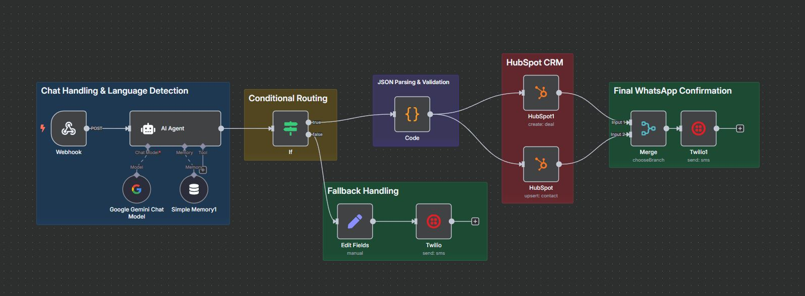

# Multilingual AI Sales Agent (n8n Workflow)

This is an n8n MVP for a multilingual sales agent capable of handling customer queries in **English**, **Egyptian Arabic**, and **Saudi Arabic**.

## 📊 Workflow Overview

## 🌐 Features

- Auto-detect language (or ask if unknown)
- Collect email, service, business name, and budget
- Create contact & deal in HubSpot
- Send confirmations via WhatsApp using Twilio
- Uses Google Gemini for smart multilingual interaction
- Built on n8n with visual low-code design

## 🧠 Tech Stack

- **n8n**
- **LangChain AI Agent**
- **Google Gemini (via LangChain)**
- **HubSpot CRM**
- **Twilio WhatsApp API**

## 📂 How to Use

1. Open your n8n instance
2. Import `workflow.json`
3. Set up credentials:
   - Google Gemini (PaLM)
   - Twilio
   - HubSpot (OAuth2)
4. Activate webhook endpoint
5. Test via WhatsApp (e.g., Twilio sandbox)

## 🔐 Credentials Required

- Twilio WhatsApp API
- Google Gemini API Key
- HubSpot OAuth2 connection

## 📝 Notes

- All user responses are translated to English before being written in the JSON output.
- Only the specified three languages are supported.
- JSON is only generated after all inputs are received.

---

## 📄 License

MIT
